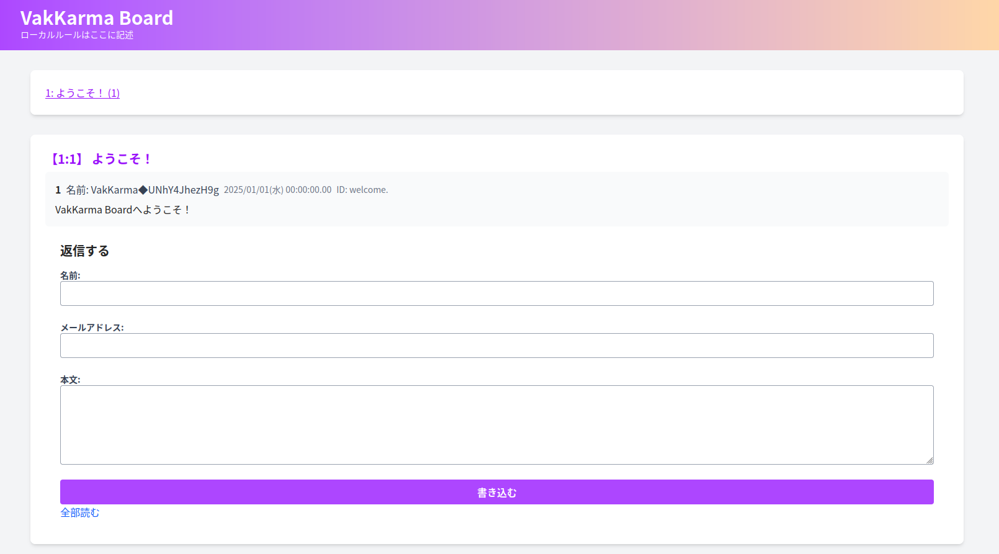

<div align="center">
  
  <h1>VakKarma</h1>
  
  <p>2ちゃんねる風のスレッドフロート型BBS</p>
</div>

## 概要

VakKarma は、2 ちゃんねる風のスレッドフロート型 BBS です。  
ゼロちゃんねるプラスを参考に開発されました。

### 主な特徴

- [ゼロちゃんねるプラス](https://ja.osdn.net/projects/zerochplus/)に似た UI
- スレッドフロート型
- クライアントサイドで JavaScript を使用しない動作
- レスポンシブデザインへの対応(Tailwind CSS を採用)
- 1 コマンドでデプロイ(docker compose を採用)
- [ChMate](https://play.google.com/store/apps/details?id=jp.co.airfront.android.a2chMate&hl=ja)への対応

## インストール

### 本番環境

本番環境では、以下のコンテナが起動します。

| サービス   | 概要                              |
| ---------- | --------------------------------- |
| Traefik    | リバースプロキシ                  |
| PostgreSQL | データベース                      |
| Bun        | アプリケーションサーバ (VakKarma) |
| DBMate     | マイグレーションツール            |

`.env`ファイルを編集してください。

```bash
# 本番用の環境変数
TRUSTED_PROXY_ID=proxy1
POSTGRES_USER=myuser
POSTGRES_PASSWORD=mypassword
POSTGRES_DB=myapp
```

- `TRUSTED_PROXY_ID`: リバースプロキシの識別子。ユーザに推測されないように設定してください。
- `POSTGRES_USER`: データベースのユーザ名
- `POSTGRES_PASSWORD`: データベースのパスワード
- `POSTGRES_DB`: データベース名

次に、Docker の有効な環境で以下のコマンドを実行してください。

```bash
docker compose -f docker-compose.prod.yml up -d
```

### 開発環境

開発環境では、データベースのみを Docker で起動します。
アプリケーション自体は Vite で起動します。

`.env`ファイルを編集してください。

```bash
# 開発環境用の環境変数
VITE_POSTGRES_USER=postgres
VITE_POSTGRES_PASSWORD=postgres
VITE_POSTGRES_DB=vakkarma-1
```

- `VITE_POSTGRES_USER`: データベースのユーザ名
- `VITE_POSTGRES_PASSWORD`: データベースのパスワード
- `VITE_POSTGRES_DB`: データベース名

次に、以下のコマンドを実行してください。

```bash
docker compose -f docker-compose.dev.yml up -d
```

アプリケーションを起動するには、以下のコマンドを実行してください。

```bash
pnpm install # 依存関係のインストール
sudo npm run dev # 開発サーバーの起動
```

Vite が 80 ポートで起動します。
管理者権限が必要な場合は、`sudo`を付けてください。

なお、他のポートで動作させる場合や一般公開が必要ない場合は、`vite.config.ts`を編集してください。

## 専ブラ(ChMate)での登録方法

`https://example.com/` が VakKarma の URL であるとき、`https://example.com/senbura/`を URL に登録してください。

## 利用技術

| パッケージ名               | バージョン | 説明                                                                                                                  |
| :------------------------- | :--------- | :-------------------------------------------------------------------------------------------------------------------- |
| `hono`                     | `^4.7.0`   | 軽量ウェブフレームワークで、Express や Koa に似ており、HTTP リクエストとレスポンスを処理。                            |
| `honox`                    | `^0.1.34`  | Hono に基づくメタフレームワークで、Hono と Vite を使用したアプリケーション開発を簡素化。                              |
| `postgres`                 | `^3.4.5`   | Node.js で PostgreSQL データベースとインタラクション。クエリやデータ操作に使用。                                      |
| `neverthrow`               | `^8.1.1`   | Result 型を提供し、エラーを機能的に安全に処理。コードの信頼性と可読性を向上。                                         |
| `uuidv7`                   | `^1.0.2`   | 時間ベースのバージョン 7 UUID を生成。アプリケーション内で一意の識別子を生成。                                        |
| `bcrypt-ts`                | `^6.0.0`   | BCrypt アルゴリズムを使用したパスワードハッシュ化を TypeScript でサポート。パスワードの安全なハッシュ化と検証に使用。 |
| `iconv-lite`               | `^0.6.3`   | 幅広い文字エンコーディングの変換をサポート。テキストデータのエンコーディング変換に使用。                              |
| `encoding-japanese`        | `^2.2.0`   | 日本語文字エンコーディングの変換（例：Shift-JIS と UTF-8）を処理。テキストデータの多言語対応に役立つ。                |
| `tailwindcss`              | `^4.0.5`   | ユーティリティファーストの CSS フレームワーク。迅速かつ一貫したスタイリングに使用。                                   |
| `vite`                     | `^6.1.0`   | モダンウェブアプリケーションのビルドツール。ホットモジュールリプレイスメントと最適化を提供。                          |
| `@tailwindcss/vite`        | `^4.0.5`   | Vite との Tailwind CSS 統合。迅速なスタイリングのためのユーティリティクラスを使用可能。                               |
| `@ts-safeql/eslint-plugin` | `^3.6.6`   | PostgreSQL の生 SQL クエリから TypeScript 型を検証・自動生成する ESLint プラグイン。SQL クエリの型安全性を確保。      |

## ロードマップ

- [ ] 管理画面へのリンク追加 (easy)
- [ ] ログの出力 (easy)
- [ ] テストの記述 (easy~medium)
- [ ] コンテンツの最大長制限への対応 (medium)
  - `createResponseContent`の非同期関数化  
    高階関数パターンの導入
- [ ] 信頼できる IP アドレスを外部から設定できるようにする
- [ ] Cloudflare Captcha(turnstile)への対応
- [ ] Config/Env をセットアップするシェルスクリプトの実装
- [ ] レスの範囲を指定するページの追加
- [ ] NG ワード機能の実装
- [ ] レス検索機能の実装
- [ ] https に対応するスクリプトの追加
- [ ] ログイン機能の実装(very hard)
- [ ] 複数板を扱う機能の実装(very hard)

## License

MIT？とりあえず

## 開発者

- [calloc134](https://github.com/calloc134)
